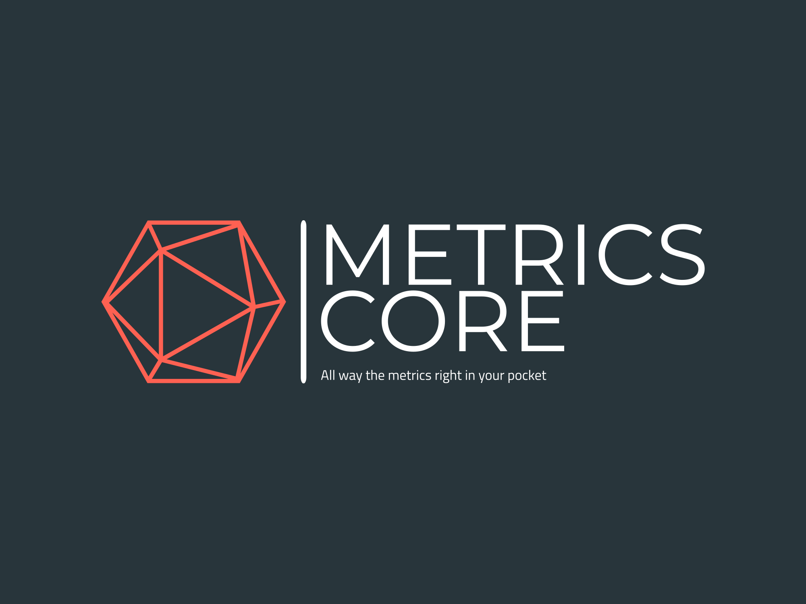

# Prototype-Tessera-DFE - Metrics Core Gen 2

Directed acyclic graph processing software. \
Latest application version: **1.0.4 prototype-2**

### CHANGE LOG

Feature #24290 - Patch 1.0.4
- added metric disk_io_util

Feature #20932 - Patch 1.0.2 - Prometheus dropping data too early (before the graph will be calculated)
- ApiPrometheus update to v0.2.1 (data drop timeout in interface);
- changed connection timeout from 10 to 1 sec in DaoPrometheus;
- added singleton in DaoPrometheusQueryConfigurations (fix reinitialisations when modules loading);
- updated ServicePrometheus for reading prometheus api configurations;
- application updated to v1.0.2"